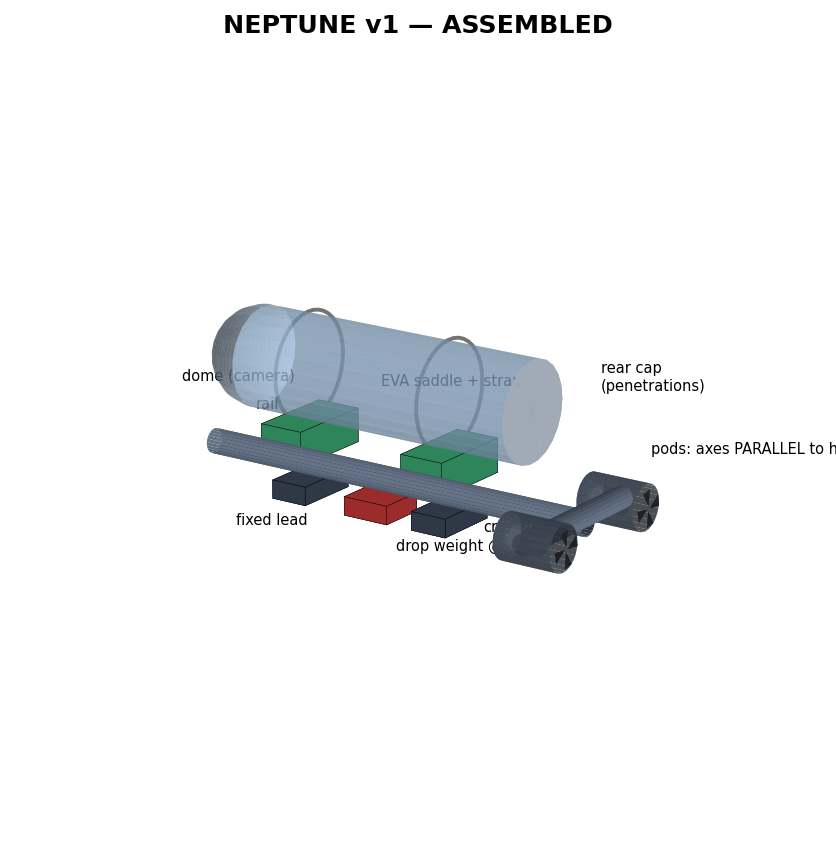
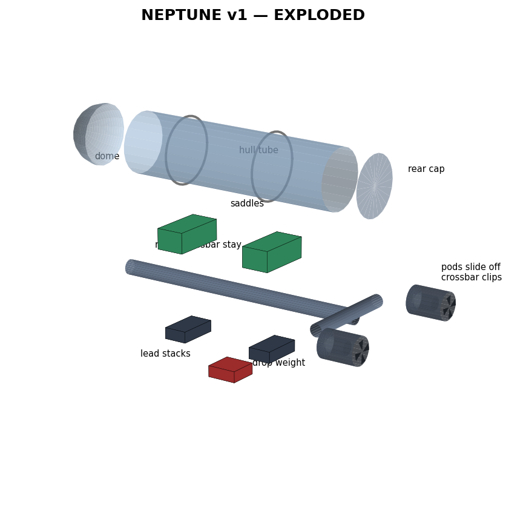
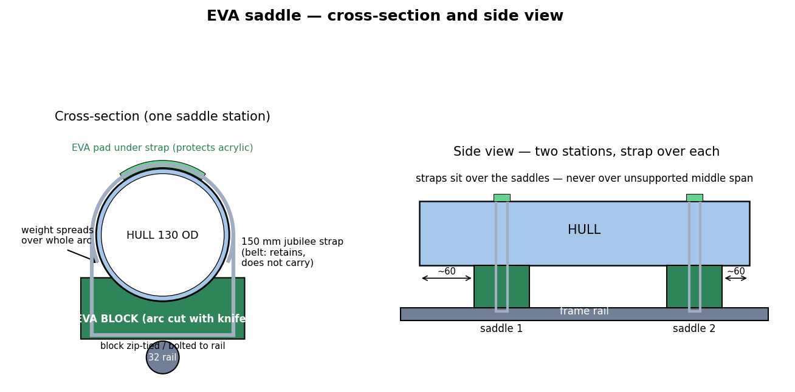
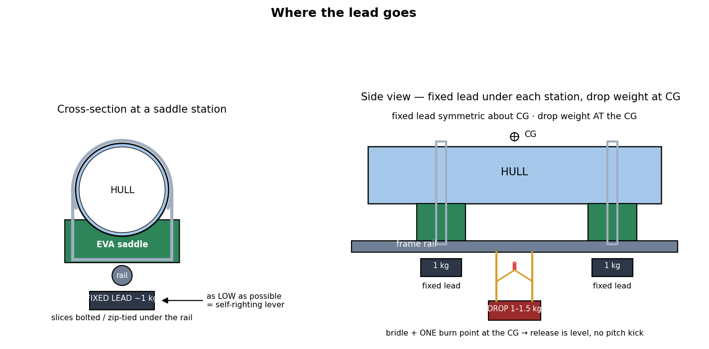
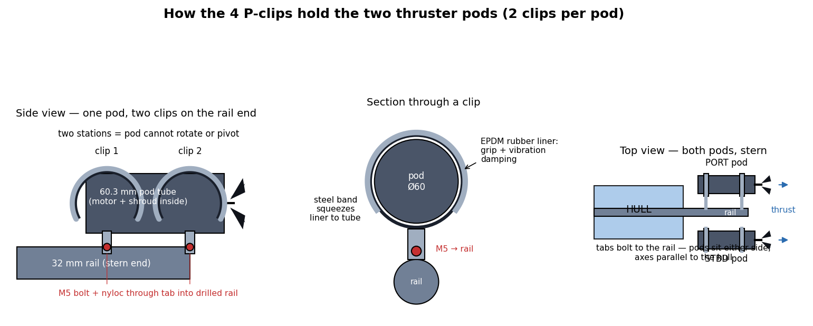
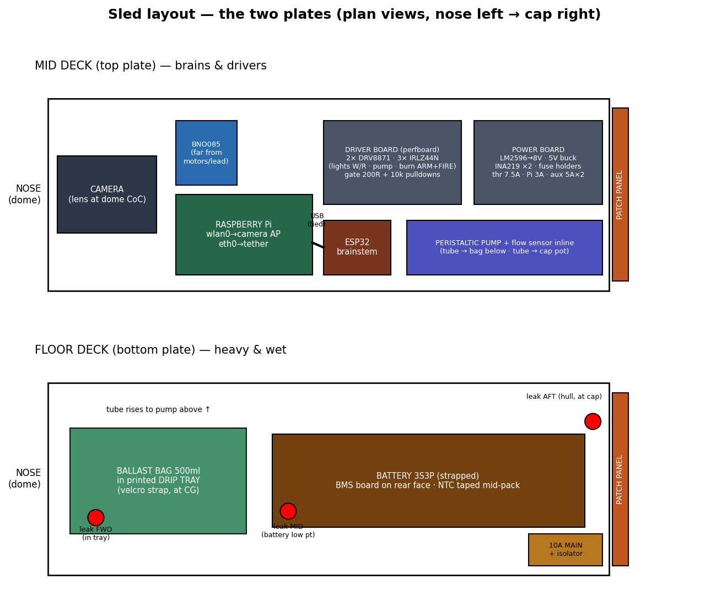

# NEPTUNE — the hardware document

The one taken **shopping** and to the **workbench**. This page describes **the vehicle as
bought** — the 2026-08-18 order (~£500, every major part) that closed a two-week design
campaign. The campaign's full outputs live beside this page in
[`docs/handoff/`](handoff/): the master handoff prompt, the founding software specs,
three design PDFs and seven drawings. This page is the buildable digest; the handoff
prompt is the campaign's own record; where they disagree, whichever was edited later wins
and the other is a defect.

**Where the software lags the vehicle, this page says so** with a `SOFTWARE GAP` marker
rather than describing dead hardware as current. The gaps are collected in §20 — that
list **is** the integration backlog. `api/hardware.py` and `api/config.py` still
implement the pre-campaign bench vehicle (2S pack, syringe ballast, paddlewheel, all
sensing on Pi GPIO); until integration lands, `NEPTUNE_HW=auto` keeps falling back to the
bench simulator, honestly, and the git history of this file preserves the old vehicle's
full documentation.

**The honesty rule this build is arranged around.** A sensor that is not answering reports
*cannot-tell*, never a plausible number — and **"not answering" includes a sensor that was
here and stopped**, which is the case you will actually meet at the waterside. §13 is what
each part's death looks like; `.specs/design.md` §24 is why it is written that way. A
"safe" default is not safe when the default is itself a reading: `0.0` heading is **due
north**, `0.0` depth is **the surface**, and a leak state of `NORMAL` is a **positive
claim that the hull is dry**.

**The safety rule that governs every mechanical decision:** anything whose failure makes
the boat unrecoverable must fail toward *"boat comes home slowly"*, never *"state changes
violently"*. **Every failure ends at the surface.**

---

## 1. The vehicle at a glance




Tethered inspection/survey ROV for **UK canals and lakes** — 1–3 m typical, design-good to
~10 m; the hull is good for 30 m+, the tether is the real limit. Missions: camera survey,
dead-reckoned mapping, bathymetry (sonar overlay on the map). Topside is the **ROG Ally**
running the dashboard in this repo.

One **130 mm acrylic tube** rides in EVA saddles on a single **32 mm pipe rail**; lead
hangs under the rail in gym-stack posts; two **390-class thruster pods** clip to the rail
at the stern; a **drop weight** hangs at the CG on a burn-wire bridle. Inside the tube, a
two-deck acrylic **sled** carries battery, Pi, ESP32 brainstem, drivers and the ballast
pump, and unplugs at a rear connector bus. The full 30-part keyed views are
[`handoff/neptune-3d-master.pdf`](handoff/neptune-3d-master.pdf).

**Flying doctrine:** trim to neutral or a whisker positive with the ballast bag; **fly
depth with thrusters + pitch**. The bag is a bias, not a control surface;
bottom-parking is bag-slightly-full; the drop weight is emergency only.

**The dive stack** — every layer, its question, and its timescale:

| Layer | Question it answers | Authority | Timescale |
|---|---|---|---|
| Hull displacement | — | **+~4.8 kg of lift** to cancel | build-time |
| Fixed lead (~2 kg) | "is this boat sinkable at all?" | boat floats **+150 g** on lead alone | build-time |
| Drop weight (1–1.5 kg) | "diveable today / EMERGENCY UP" | seated = barely positive | per-dive / instant |
| Ballast bag (±250 g) | "which side of neutral, how firmly?" | crosses the neutral line | minutes |
| Thrusters + pitch | "what depth right now?" | — | seconds |
| The bottom itself | "park here" (bag slightly full) | — | loiter |

---

## 2. Bill of materials — the bought bill

Status: ✅ ordered/arrived · ⏳ in-basket · 🔲 to-buy · 📦 owned/salvaged. Prices are what
was paid. The handoff prompt §13 carries the same list with per-listing notes; keep the
two in step.

### Hull & sealing

| St | Item | £ | Purpose |
|---|---|---|---|
| ✅ | Acrylic tube **130 OD × 400 mm, 5 mm cast** (AQUROV) | 50.79 | the pressure hull. ID ~120, usable ~350 after flanges |
| ✅ | **Dome assembly 130 mm** with integrated flange + O-rings (Zhifeng) | 69.79 | front end, complete — verify flange/rings on arrival |
| ✅ | Watertight flange 130 mm (ROVWAKER), qty **1** | 56.39 | rear seal interface. One is correct — the dome has its own |
| 📦 | 10 mm acrylic sheet | — | DIY rear cap, connector bus bar, X-mounts, sled partition |
| ✅ | Gland assortment PG7–PG16, 25 pc | 9.39 | tether gland + serviceable future crossings |
| ✅ | PG7 + M12-6.5 glands (earlier order) | 5.40 | |
| ✅ | Silicone grease 10 g | 2.53 | the O-ring ritual |
| 🔲 | M6 nylon vent screw + O-ring | — | vacuum-test port in the rear cap |
| 🔲 | Epoxy (verify bench stock) | — | every potted penetration |
| 🔲 | Spare O-rings, flange size (if the kits lack them) | — | pennies; the ritual assumes spares exist |

### Frame & mounting

| St | Item | £ | Purpose |
|---|---|---|---|
| 🔲 | 32 mm waste pipe + fittings (B&Q) | ~5 | the rail spine — everything clamps to it |
| ✅ | EVA yoga blocks ×2 | 5.46 | hull saddles, knife-cut to a slightly-undersize 130 arc |
| ✅ | Jubilee clips 150 mm ×2 | 5.16 | hull + saddle + rail in one loop each |
| ✅ | P-clips Ø60 rubber-lined, 2 pc × 2 packs | 13.80 | four clips = two per thruster pod |
| ✅ | Washer kit 260 pc | 3.73 | washers under every head that meets acrylic |
| ✅ | M2–M6 304 assortment box (earlier) | — | the fastener ladder, §4 |
| ✅ | M6 wing nuts 10 pc / M6 nylocs 20 pc / M6 304 rod 300 mm ×2 | 7.09 | gym-stack ballast posts |
| 🔲 | Medium (blue) threadlock | ~2 | **in no basket anywhere — critical**; every thruster-path fastener |
| ✅ | Zip ties 3×100 green + 3×150 purple, 100 pc each | 3.16 | not UV-black — replace seasonally; 🔲 UV-black 200 pk later |

### Ballast & release

| St | Item | £ | Purpose |
|---|---|---|---|
| ⏳ | Lead sheet offcuts, 3 kg (eBay, roofer) | 17.49 | fixed stacks + drop weight. Cold-cut only — score/snap, saw, chisel; **never grind or sand lead** |
| ✅ | TPU soft flask 500 ml ×2 | 4.99 | the trim bag + spare. Run part-filled, 50–80 % |
| ✅ | Peristaltic pump 12 V | 4.96 | moves lake water in/out of the bag. 🔲 2nd = spare (tube is a ~1 yr consumable) |
| ✅ | YF-TM02 flow sensor ×2 | 3.98 | one inline on the ballast tube counting ml, one is the speed log (§11) |
| ✅ | PP barbs 4.1 mm, 5 pc | 1.51 | flask cap + tube ends |
| 🔲 | Silicone/PU pump tube 2 m | ~2 | check whether the pump ships with it |
| 🔲 | Nichrome 0.3 mm (vape shop) | ~2 | the burn point |
| 🔲 | Nylon mono 0.5 mm + paracord (fishing shop) | ~5 | bridle + tether strength member |
| ✅ | Cement resistors: 10 W 1R ×10 · 5 W 22R ×10 · 5 W 68R ×10 | 6.03 | burn series pair (2×1R = 2R/20 W) · white strings · red string |
| ✅ | IRLZ44N ×10 | 1.45 | burn, lamps, pump gates |

### Propulsion

| St | Item | £ | Purpose |
|---|---|---|---|
| ✅ | **390 "underwater thruster" motor pair**, L+R, props, shaft-gasket bulkhead discs, screws (POBOTRAE) | 23.99 | 7.4–8.4 V, 29 mm dia, **2.3 mm shaft**, 25 mm shaft length, ~12 000 rpm no-load. Left pushes forward with CCW prop, right with CW |
| ✅ | D50 4-blade paddle prop pair | 2.70 | the upgrade props — high blade area, low pitch |
| ✅ | Brass couplers 2.3→4 mm ×2 | 1.62 | ⚠ **verify pieces per pack — want 4.** Grub screws onto filed flats, threadlocked |
| ⏳ | 60.3 mm PVC pipe, 425 mm (eBay) | 13.98 | two 75 mm shroud rings + spare |
| 📦 | DRV8871 ×2 | — | the drivers. 3.6 A current limit **accepted for v1** — see §5 |
| ✅ | LM2596 ×3 | 1.82 | the 8 V thruster rail |
| 🔲 | BTS7960 ×2 | ~6 | only if the 3.6 A limit proves short in practice |

### Power

| St | Item | £ | Purpose |
|---|---|---|---|
| 📦 | **3S3P pack, 11.1 V nominal, 6.0 Ah real** — 9× INR18650 2.0 Ah from a rebuilt ThinkPad clone pack | — | §7. **Deeply discharged (~3.0 V/group) — recovery charge is URGENT** |
| ✅ | DollaTek 3S 12 V 40 A balance BMS, 2 pc | 5.99 | common-port, with equilibrium charging. Wiring order is life-or-death for the chip: §7.2 |
| 🔲 | 12.6 V 2 A CC-CV brick | ~8 | **only if** the owned adaptive brick does not say exactly 12.6 V — verify the label; 12.0 V = 80 % and not a charger |
| ✅ | 50 A isolator switch | 3.46 | the reachable off |
| ✅ | Mini inline fuse holders 5 pc ×2 | 10.30 | five on the boat, five spares/bench |
| ✅ | Fuse box 180 pc micro+mini+standard | 5.20 | boat standard = **mini** |
| ✅ | XT60 5-pair | 5.27 | **exactly enough, zero spare** — 🔲 second pack is a nice-to-have |
| ✅ | 5 V 3 A mini buck | 0.74 | the Pi rail |
| ✅ | Wire: 18 AWG 10 m · 22 AWG 10 m · 28 AWG 5 m | 12.01 | backbone/thrusters/burn · lights/pump/bucks · signals. **Cut the two thruster runs first, full length + slack** |
| ✅ | JST-XH pre-crimped kit | 9.79 | every signal connector — and the LiPo balance-lead standard, for free |

### Electronics

| St | Item | £ | Purpose |
|---|---|---|---|
| ✅ | **ESP32 WROOM-32 DevKit ×2** | 7.26 | the brainstem + flashed spare / future sonar front-end. C3s and 8266s **rejected** for this seat — §8 |
| 📦 | Raspberry Pi 3B+ | — | the commander |
| ✅ | BNO085 IMU | 16.39 | fused yaw, mag-cal status, pitch/roll, gyro rate, linear accel |
| ✅ | MS5837-30BA | 6.00 | measured depth — the only thing that knows how deep the sub is. Lives **at the cap**, gel face potted out |
| ✅ | INA219 ×2 | 2.08 | #1 pack, #2 thruster rail — the divergence spots a failing motor |
| ✅ | Leak sensor boards 5 pc | 1.64 | three zones fitted (FWD/MID/AFT) + spares |
| ✅ | NTC 10K 10 pc | 1.12 | pack temperature, taped mid-pack |
| ✅ | PAS pedal ring | 3.21 | 12 PPR ×4 quadrature speed backup **with direction** — the only sensor that knows backward from forward |
| ✅ | Micro limit switches 10 pc | 1.36 | spares drawer (the ballast end stops died with the syringe) |
| ✅ | Protoboards 10 pc | 1.80 | driver board, power board, JST backplane |
| ✅ | Resistor kit ¼ W 30-value 300 pc | 2.43 | 220R gates, 10k pulldowns, 4.7k I²C, 10k/20k flow divider, NTC partner |
| 🔲 | M3 brass standoff box | ~4 | every board on standoffs; brass = compass-safe |
| 📦 | 8266 fleet + C3 SuperMinis | — | bench rig / topside monitor / pure witness **only** — never gates or actuators (§8) |

### Lights, camera, topside, sonar

| St | Item | £ | Purpose |
|---|---|---|---|
| 📦 | Headlamp housing | — | aimable, saddle-mounted, greased seals, switch bypassed, driver board removed |
| ✅ | 3 W star LEDs 10 pc (earlier) | 1.89 | white spots — **must mount on metal** |
| 📦 | LiFePO4 cell pair (3.65 V/2 V labels) | — | **not Li-ion, never mix, own charger** → future independent self-flashing emergency beacon |
| 📦 | WOLFANG 4K action cam · ROG Ally · flat Cat5e 7–10 m | — | camera plane + topside + tether (paracord member 🔲) |
| 🔲 | RJ45 keystone jack | ~2 | tether landing on the connector bus |
| 🔲 | **TL88 / LUCKY FF1108-1-class wired fishfinder** | ~13 | the sonar donor — §12. Reject wireless/castable variants and the £25.66 listing (same unit, double price) |
| ⏳ | Toslon 640 / Skipper 600 eBay bid, **max £8** | — | parts donor only (transducer, maybe-NMEA GPS): no receiver, proprietary RF, not a data path |

---

## 3. Hull and sealing

**RULE: drill the frame freely, drill the hull NEVER.** The hull carries nothing; it
rides in saddles. Every hole, bolt boss or glued lug is a stress concentration in a
pressure vessel, and cast acrylic crazes silently before it cracks. The only holes are in
the **DIY rear cap** (10 mm acrylic disc, bolted to the ROVWAKER flange face seal —
step-drill, washers under heads, no countersinks), which is the entire waterproofing of
the boat concentrated in one serviceable disc.

**Rear-cap penetrations** (the full numbered map is FIG 3 of
[`handoff/neptune-integration-doc.pdf`](handoff/neptune-integration-doc.pdf)):

| # | Crossing | Method |
|---|---|---|
| 1–2 | thruster P, thruster S (18 AWG pairs) | potted epoxy pigtail → XT60 on the bus |
| 3 | lights (3-wire: W+, R+, GND) | potted pigtail → JST |
| 4 | burn wire pair | potted pigtail → JST |
| 5 | leak-AFT probe | potted pigtail → JST |
| 6 | sensor spare | potted, blanked |
| 7 | ballast pump tube | tube potted directly — a static seal, like every other |
| 8 | tether | **PG7 gland** — the one crossing that takes handling load and gets replaced |
| 9 | vent | **M6 nylon screw + O-ring** — vacuum-test port, cracked before every cap removal |
| 10 | MS5837 | potted **gel face out** — it must touch the water |

Potting rules: drill oversize, rough the bore, degrease, slow-cure epoxy wicked along the
insulation, and strip a few mm of each conductor mid-pot so epoxy reaches bare copper —
stranded wire is a bundle of capillaries and water wicks *inside* the jacket past any
external seal. Pot **pigtails ending in connectors**, never the loom itself. Small or
multi-conductor crossings are always potted, never glanded — a gland's donut cannot close
the channel between two loose wires. Glands are for one round jacketed cable you will
want to remove; that is the tether, and almost nothing else.

**Seal regime.** Thin film of silicone grease on every O-ring at every closure; wipe
groove and ring, feel for nicks, replace on suspicion. **Vacuum test 10 minutes before
every dive** via the vent port (syringe or brake bleeder). Desiccant sachet inside —
first-cold-dive condensation on the dome looks exactly like a leak on the video feed.
Commissioning: cap-on-jar vacuum test after potting, then the **overnight weighted bucket
test** with a paper-towel telltale, which shows a teaspoon of seep the eye misses.

Displacement ≈ **4.8 L** → the boat carries **~3 kg of lead** (§6). OPEN: message all
three hull sellers to confirm 130 mm cross-compatibility (ROVMAKER-standard 130 × 5
tube) — three storefronts, one O-ring tolerance.

---

## 4. Frame and mounting



One **32 mm waste-pipe rail** is the spine; everything on the boat attaches to it by
clamp, strap, pin or wing nut, and everything slides for trim before it tightens.

- **Hull:** two EVA yoga-block saddles, knife-cut to a slightly-undersize 130 mm arc so
  the foam compresses to grip. One **150 mm jubilee per station loops hull + saddle +
  rail together**, with an EVA pad between band and acrylic — the saddle positions, the
  strap retains, the rail carries. Straps sit **over the flange zones ~60 mm from the
  ends** (the hull's stiffest rings), never mid-span. Witness-mark tape across
  tube-and-saddle makes creep visible; re-tension a quarter turn after the first cold
  dive — cold wet EVA compresses.
- **Thrusters:** pods clip **directly to the rail's stern end** — two Ø60 rubber-lined
  P-clips per pod, M5 + nyloc through drilled rail holes, bores facing aft, prop discs
  behind the cap plane, axes parallel to the keel. The rubber is grip *and* vibration
  isolation for the IMU's sake. If v1 turns lazily, the retrofit is one clamped
  crossbar spreading the pods — a single spanner job.
- **Lead:** the **gym-stack** system. M6 304 threaded-rod posts (~80 mm, cut from the
  300 mm lengths) hang under the rail at each saddle station; lead slices drilled to a
  shared **template** (slotted 7 × 12 mm holes — ±5 mm of fore-aft micro-trim) slide on;
  washer + **wing nut with a nyloc jam-locked behind it** clamps the stack silent.
  ~1 kg per station, as low as the frame allows — buoyant hull high, lead low is the
  pendulum that self-rights the boat.



**The fastener ladder** — two seconds per future decision: M2.5–M3 boards to decks ·
M4 small brackets and clip tabs · M5 structure (P-clips, saddle hardware) · M6 anything
carrying kilograms (ballast posts, bridle pins). Every fastener on the thruster path
gets a nyloc or threadlock, no exceptions — the thrusters are the boat's vibration
source and their own mounts are the first thing they shake loose.

**External cabling:** zip ties **through drilled rail holes** every 100–150 mm (a tie
looped around a smooth wet pipe slides and rotates; a tie through two holes is anchored
forever); a 30–50 mm service loop at every endpoint; chafe sleeve wherever a steel band
edge meets insulation; runs under the rail, out of bank-knock reach. **No superglue
anywhere wet — it debonds in water.** The tether's paracord member ties to the rail
first; the Cat5e runs slack behind it, and neither the RJ45 nor a potted joint ever
feels tension. Acceptance: **the tug test** — pull any external cable mid-span and the
force must die at a zip-tie anchor with slack behind it, never at a pot.

---

## 5. Propulsion

**Motors: the 390 pair, run at 8 V.** 7.4–8.4 V rated; feed them from an **LM2596 set to
8 V**, not the 11 V pack — a 390 at 11 V screams, cooks brushes and chews props. The kit's
shaft-gasket bulkhead discs mean the motor sits dry with only the shaft wet — a
factory-solved shaft seal; grease it and inspect seasonally like every other seal.

**Drivers: DRV8871 ×2 (owned), 3.6 A current limit accepted for v1.** A 390's stall
exceeds 3.6 A; the limit is what makes that survivable — it costs peak grunt at stall and
protects the silicon, which for a canal boat with a 3–6 N drag budget is the right trade.
The escalation, if real water disagrees, is BTS7960 ×2 (£6) with the same PWM interface.
`SOFTWARE GAP:` the shipped pin constants drive the old six-pin H-bridge layout; the
DRV8871 pair takes **GPIO 23/24 (L) and 5/6 (R)** — IN1/IN2 only, no EN pin — which
becomes the Pi's *entire* GPIO footprint (§8).

**Props:** run the kit's own 3-blade pair first — the matched baseline. The **D50
4-blade paddles** are the upgrade: high blade area, low pitch, the right shape for
bollard-pull work. They bore 4 mm against a 2.3 mm shaft, hence the brass grub-screw
couplers. The assembly ritual is mandatory, not cautious: **file a flat on the shaft,
threadlock the grub screws** — a screw on round polished steel is a timer, and a dropped
prop in a canal is gone.

**Shrouds:** two 75 mm rings cut from the 60.3 mm PVC, motor held centred by **acrylic
X-mount strips** screwed to the kit's bulkhead disc, X-legs bolted or zip-tied to the
ring wall. Self-jigging and coaxial by construction. A cylindrical guard adds **zero
thrust** — it is debris armour only, which in a canal full of bags and weed is worth
having on its own. The endgame is the printed **OpenThruster Duct 37 + Kaplan prop**
matched set (foil-profile duct, ~20–25 % static-thrust bonus, symmetric in reverse):
sources at github.com/DisCoLabIITK/OpenThruster and
data.mendeley.com/datasets/yfg487zbkp/1 — scale the duct to the prop, swap the motor
pocket for a 390.

**The interface standard**, which is what makes all of this swappable: *a 60–70 mm
cylinder held in two P-clips*. Any future pod — printed duct, bought brushless, anything
— that is roughly a cylinder drops into the same clips at the bank.



(The earlier flat-plate cassette design is superseded — kept for history as
[`handoff/thruster-cassette.png`](handoff/thruster-cassette.png).)

---

## 6. Ballast

Three independent layers, no moving seal anywhere (the design rule that killed the
syringe: **only static seals cross the pressure boundary** — wires, tubes, nylon; never
a shaft, never a plunger).

**Layer 1 — fixed lead, ~2 kg** in the gym stacks. Set once at the bathtub ceremony so
the boat floats **+150 g positive on lead alone** — lose everything else and it creeps
home. Venue tuning forever after is wing-nut arithmetic: chronically floaty → add a
slice; heavy → remove one; slightly off today → pump.

**Layer 2 — drop weight, 1–1.5 kg at the CG**, on the burn-wire bridle. Seated, the boat
is barely positive; released, it is decisively so, from anywhere in the trim envelope.
Details in §6.1.

**Layer 3 — the trim vernier: pump + bag, ±250 g.** A **500 ml TPU soft flask**,
part-filled (50–80 % — a drum-tight bag stresses its seams and back-pressures the pump),
sits in a printed **drip tray at the CG, velcro-strapped, neck up** so stray air collects
at the port and self-purges on the empty stroke. A **12 V peristaltic pump** moves lake
water in and out through one potted tube: *lake ⇄ potted tube ⇄ pump ⇄ bag*. Why a
peristaltic: **no seal ever touches the water** (rollers squeeze a tube), the pinched
tube is its own check valve (no backflow, no solenoid), it self-primes, and it pushes
1–1.5 bar ≈ 10–15 m of depth. Flow is slow (~1–2 g/s) and that is fine — trim is not a
hurry; the thrusters own "now". The **YF-TM02 flow sensor sits inline counting
millilitres**, so `ballast_ml` is a measurement, not a stopwatch guess.

**Homing:** peristaltics don't mind running dry, so pre-flight is *purge-home* — run the
pump against the empty bag ~10 s, call that zero, pump to mid-fill by count. `ballast_ml`
is absolute at every power-up, the same honesty the syringe's end stop used to buy.
`SOFTWARE GAP:` the shipped code homes a stepper against limit switches; the pump
version of `get_ballast_level()` (still `None` until homed) is integration work, and the
loop closes **on the ESP32** — `pump_ml: 50` goes down the wire, the brainstem PWMs the
pump, counts pulses, stops, and acks the measured figure. The Pi never sees a pulse.

**The diagnostic gift** worth wiring into the blackbox analysis: a **bag leak** reads as
leak-FWD (the tray probe) plus `ballast_ml` drifting against pump commands **without
depth correlation**; a **hull leak** is depth-correlated. The vehicle can tell you which
water this is from the bank.

Consumables: the pump tube hardens in about a year — spare tube (and ideally a spare £5
pump) live in the dive bag. mk2, pencilled and pre-allocated sled volume: an **air-blow
tank** (external vessel + air pump + solenoid) as a fast emergency blow; the drip-tray
bay anticipates it.

### 6.1 Drop weight and burn-wire release

Promoted from v2 to **v1, bought**, 2026-08-18. Full geometry and cut templates:
[`handoff/drop-weight-release-design.pdf`](handoff/drop-weight-release-design.pdf) — with
one supersession: the **continuous-loop bridle** below replaces that PDF's single-loop
figure.

- **The weight:** lead slices stacked to 1–1.5 kg, through-bolted with **two stainless
  M5s** — the bolts are the structure *and* the bridle's load path (steel through lead,
  never glue; lead's oxide makes adhesive bonds unreliable). Epoxy only as anti-rattle
  butter and a sealing paint coat. Pin-notches chiselled into the stack edges, sized
  loose.
- **The seat:** convex features — pins into chamfered notches, weight pulled into them
  by the taut loop. **NEVER a pocket**: silt and suction turn pockets into
  weight-keepers. Rigid while held, zero constraint the instant it is free; gravity is
  the ejection mechanism.
- **The bridle:** one continuous run of 0.5 mm nylon mono — over the fore pin, under the
  weight's bolt bar, over the aft pin, both ends down to **one tensioned tail through a
  single nichrome coil** anchored to the saddle. Burn the tail → the whole loop slackens
  everywhere at once → the weight drops **level** off both pins. It is an H made of
  string, and a slack loop cannot wedge. Re-arm = tie a fresh 10 cm loop at the bank,
  two minutes.
- **The firing circuit:** 3–4 turns of 0.3 mm nichrome around one leg of the tail;
  **2× 1 Ω 10 W cement resistors in series (= 2 Ω / 20 W)** set a gentle ~2 A profile;
  IRLZ44N gate with 220R + 10k pulldown; its own 5 A fuse. Wet nichrome needs roughly
  double the air current to reach temperature locally — the 2 A class is chosen for
  exactly that headroom. Nichrome takes no solder: crimp or clamp, never iron.
  Firing is a **two-pin interlock on the ESP32 — ARM (GPIO14) + FIRE (GPIO33)** — and
  the brainstem closes the final gate only if its own state agrees. `SOFTWARE GAP:`
  `release_dropweight()` is still the loud "not fitted" stub; it becomes a two-step
  serial command with its own blackbox correlation stage.
- **Trigger doctrine** (from the release design work): operator-explicit always — a
  console *offer* on ballast-fault + held E-SURFACE, a deliberate manual chord — and
  nothing automatic except, someday, a dead-vehicle countdown. An auto-release under a
  culvert or a moored boat pins the sub against the roof. The release's real job is
  **snagged-and-dead**: it turns "stuck on the bottom" into "floating, tether marks the
  spot". v1 recovery remains *empty the ballast and pull the tether* — the tether is
  the recovery system.
- **Bench ritual before it ever guards anything:** bucket fire ×3, ammeter inline;
  the measured current goes into config as the expected firing signature.

---

## 7. Power

### 7.1 The pack — recovered 3S3P, and a deadline

Nine **INR18650 2.0 Ah** cells (3S3P, factory spot-welds kept intact) out of a rebuilt
ThinkPad clone pack — the label's "7800 mAh" lied; the wrappers say **6.0 Ah real /
~65 Wh**, which runs the boat comfortably. The SMBus laptop BMS is removed (it gates
discharge on a laptop handshake and bricks itself on "tamper" — worse than useless
here). The block is Kapton-wrapped, wrapper scuffs patched, and it measured a healthy,
evenly-spaced ladder — **0 / 3.0 / 6.0 / 9.3 V** — which is structurally sound and
**deeply discharged**. Cells degrade below 3.0 V/cell:

> **The recovery charge is the only item in this project with a clock on it. BMS on and
> a supervised first charge before anything else is built.**

First charge: supervised, fireproof surface, **~0.5 A until every group is past
3.3 V/group**, then normal rate. Watch the slightly-high group converge — balance-lead
divergence during charge is the broken-parallel-weld signature (a group running on two
cells charges faster); confirm with the car-bulb sag test if suspected. A warm balance
resistor near full charge is the balancing *working*, not a fault.

### 7.2 BMS and charging

**DollaTek 3S 40 A common-port balance BMS.** Wire the taps **strictly ascending — B−
(black, 0 V) → B1 (wobbly yellow, ~3.0) → B2 (marker yellow, ~6.0) → B+ (red, 9.3)** —
order violation kills the chip on contact. The tap identities come from the **multimeter
ladder, never from wire colour or marker** — the voltages are the truth, the labels are
tape flags written during measurement. Big pads want 18 AWG, pad and wire tinned
separately, a few extra seconds of iron (the tabs are heatsinks).

Common port = one XT60 does everything: **charger and boat meet the pack at the same
plug, one at a time**. Charger must be a **12.6 V CC-CV** source — the owned adaptive
brick qualifies **only if its label says exactly 12.6 V** (12.0 V is a bench PSU that
stops a pack at 80 %); otherwise the £8 brick, barrel cut off, XT60 crimped on.

### 7.3 Distribution

```
  3S3P pack (12.6 V full / ~9.9 V empty)
     │ B-taps → DollaTek 40 A balance BMS (common port)
     ▼
  10 A MINI FUSE  — 16 AWG inline holder, shortest possible leads at the pack
     ▼
  50 A ISOLATOR  — the reachable off
     ▼
  XT60  ⇄ charger (12.6 V CC-CV) — one-plug-at-a-time, same socket
     ▼
  INA219 #1  (VIN+ ▸ shunt ▸ VIN−, high side, first in the chain)
     │
     ├─► LM2596 → 8 V ── 7.5 A fuse ── INA219 #2 ── DRV8871 ×2 ── thruster pods
     ├─► 5 V 3 A buck ── 3 A fuse ──── Raspberry Pi (ESP32 powered from Pi USB)
     ├─► 11 V ───────── 5 A fuse ──── IRLZ44N ×2 ── lamp strings (white PWM · red beacon)
     ├─► 11 V ───────── 5 A fuse ──── 2×1R (2R/20 W) ── ARM+FIRE gates ── burn coil
     └─► 11 V ──────────────────────── IRLZ44N ── peristaltic pump

  EVERY ground is common; star at the isolator output, do not daisy-chain.
```

Full drawn version: FIG 4 of the integration doc (**partially stale** — it predates the
pump/ESP32 final form; this table wins until the redraw).

| Rail | Worst case | Fuse | Wire |
|---|---|---|---|
| Pack main | ~8 A everything at once | **10 A** | 16 AWG holder, short leads |
| Thrusters | 2 × 3.6 A limited | **7.5 A** | 18 AWG |
| Pi | ~1.5 A | **3 A** | 22 AWG |
| Lights | ~1 A | **5 A** | 22 AWG |
| Burn | ~2 A pulse | **5 A** | 18 AWG |

Boat standard is **mini** fuses — one spare tub fits every holder aboard. The INA219
high-side rule survives from the old build: shunt before everything, or it reads a
comfortable lie. `SOFTWARE GAP:` battery bands in `api/config.py` are still the 2S
pack's. The 3S bands are **12.6 full / 10.5 warn / 9.9 critical / 9.0 hard floor**
(same per-cell judgements — 4.2 / 3.5 / 3.3 / 3.0 V/cell), to be confirmed at the
bathtub ceremony and then purged of the 2S scale everywhere, per R7.4's own rule. The
floor stays documented-not-enforced: safing a sub mid-canal trades a damaged pack for an
unrecoverable vehicle.

### 7.4 Wire and connector standards

18 AWG backbone/thrusters/burn · 22 AWG lights/pump/buck outputs · 28 AWG signals.
**XT60 for the three genuine power runs** (charge, thruster P, thruster S — colour-band
the trio; charger-into-thruster-socket is *the* trap), **JST-XH for everything
signal-level** including the 3-wire lamp run. One connector family per role; key or
colour anything identical side-by-side. Friction-fit Dupont jumpers are bench-life only
— latching or soldered aboard, always.

---

## 8. Electronics architecture — commander and brainstem

The structural decision of the campaign: split the electronics by **timescale and
survival**, not by function.

**Raspberry Pi = commander.** Camera plane (wlan0 → the WOLFANG AP at 192.72.1.1),
thruster PWM (DRV8871 pairs on **GPIO 23/24 and 5/6 — its only GPIO use**), the nav
solution, blackbox master, eth0 → tether → Ally. Everything else it does is USB and
Ethernet, which is what makes the commander swappable someday.

**ESP32-WROOM-32 = brainstem.** Connected to the Pi by **USB only** (serial + power, one
15 cm cable zip-tied at both ends, udev-pinned by serial number as `/dev/ttyESP`).
It owns all sensing and slow actuation:

| ESP32 pin | Function |
|---|---|
| 21 / 22 | I²C1 — BNO085, MS5837 (leads from the cap), INA219 ×2 |
| 19 | BNO085 interrupt |
| 34 / 35 / 39 | leak probes FWD / MID / AFT (input-only pins — exactly what probes want) |
| 36 | NTC pack temperature (ADC1) |
| 27 | YF-TM02 flow pulses (**PCNT** hardware counter) |
| 25 / 26 | PAS quadrature A/B (PCNT — 48 counts/rev + direction) |
| 18 | pump MOSFET (LEDC PWM) |
| 23 | white lamp (LEDC, **8 kHz** — above camera banding) |
| 13 | red beacon |
| **14 + 33** | **burn ARM + FIRE — the two-pin interlock** |

15 of ~24 usable pins; **Wi-Fi stays OFF** (the radio would elbow the camera AP inside
the hull). The input-only pins 34/35/39 soak up the leak probes — the pins nothing else
wants, doing the one job they can.

**Reflexes live on the brainstem**, so they work when the Pi is dead: leak agreement →
beacon on + surface flag; pack undervolt → log + warn; the burn gate closes **only** on
ARM + FIRE + local state agreeing. The ballast loop closes here too (§6). Decisions
above, reflexes below — the biologically-correct split.

**The protocol:** unprompted **10 Hz JSONL telemetry up**; a tiny command vocabulary
down — `pump_ml`, `trim_home`, `lamp`, `beacon`, `arm_burn` / `fire_burn` — each with a
sequence number, acked, and the acks join the blackbox `c_id` lifecycle as its own
stage. The ESP32 keeps a ring buffer of its own: the two-sided blackbox gains a **third
witness** that survives Pi death. Firmware version + SHA ride in `session_start`.
`SOFTWARE GAP:` none of this protocol exists yet — it is the first integration work
item, and `RealHardware` becomes a serial client of it. The liveness doctrine (§13)
gains the serial link as a bus-like front: link down ⇒ every reading behind it
cannot-tell, under one name.

**ESP32 #2** is the flashed spare in the dive bag and the future **sonar front-end**
(§12) — a second `/dev/ttyESP`. **The 8266 fleet and C3 SuperMinis are banned from
gates and actuators forever**: 8266 GPIOs glitch at boot (a burn-wire gate that twitches
at power-up is a release that fires in the car park) and the C3 lacks the pin budget
and PCNT hardware. They serve as bench rigs, topside monitors, and pure witnesses only.

**Board mounting:** everything on M3 brass standoffs (brass = compass-safe); the driver
board and power board stack as a **mezzanine** (20 mm standoffs, LM2596 fins up on the
top board — the warmest thing in the hull wants the free air).

---

## 9. The sled



Two decks cut from the owned 300 mm acrylic plates, **solvent-welded** (dichloromethane
cement — Harry has it) as a 300 + 50 butt joint with a doubler strip: joint under a
static mount, never under the battery strap anchors; the doubler doubles as the Ø119
mid-sled support rib. Ventilate while welding; faces dead flat; contact not clamping
pressure; **solvent never near the hull** — a drip on the pressure vessel is a permanent
craze mark.

**Floor deck** (low, ~35–40 mm below centreline — the pack's width is what lets the
heaviest thing sit lowest): battery rear-biased and strapped (BMS on its rear face, NTC
taped mid-pack), 10 A fuse + isolator right at the pack output, ballast bag in its drip
tray forward at the CG, and an **acrylic partition rib** that is spill wall + support
rib + seam doubler in one part (vent notch at the top, dressed slot for tube and wires).
Leak-FWD lives in the tray, leak-MID at the battery's low point.

**Mid deck** (at the centreline, where the bore is widest): camera on a **rigid
cantilever arm** at the nose — the lens is the only component with a mandatory
coordinate (bore centre, at the dome's centre of curvature; set-and-forget tilt on
slotted side-screw pivots; verify the insertion sweep clears the flange before fixing
the arm length). BNO085 at the nose beside it — maximum distance from motors, lead and
pump. Pi centre; ESP32 beside it on its tied-down USB cable; the driver+power mezzanine;
pump + inline flow sensor at the rear so the tube reaches its pot in centimetres.

**The connector bus bar** (10 mm acrylic, aft face, plugs pointing AFT): **XT60 ×3**
(charge in the isolated top corner / thruster P / thruster S — panel-mount XT60E/PW or
epoxied in; **colour-band the trio**), a **JST-XH backplane** (perfboard strip with
soldered shrouded headers on M3 standoffs: burn, leak-AFT, MS5837, lamp 3-pin, spares),
and an **RJ45 keystone** for the tether. Service loop and zip-tie anchor behind every
joint so unplugging force lands on the panel, never the solder.

The sled self-centres on Ø119 ribs and sits low. Acceptance tests: roll the hull on the
bench — no shift, no clunk; and **teardown to Pi-in-hand in under five minutes** (vent →
cap → seven plugs + charge port, fingers only → slide). If anything blocks that, move it.

---

## 10. Lights

The **repurposed headlamp housing**: aimable, saddle-mounted top-forward, seals greased,
switch bypassed (all switching is Pi-side… ESP32-side now), factory driver board
**removed** — direct drive, no mode-button state machine to chase. **Dummy cells** feed
it from the main pack: the battery bay becomes a sealed pass-through, and the lamp joins
the INA219's accounting and the blackbox like every other load. Weighted-bucket
overnight test before it is trusted — headlamp "waterproof" is rain-rated, not
submersion-rated, until the grease ritual says otherwise.

- **Whites:** series strings with one **22 Ω 5 W** cement resistor per string
  (~300 mA), on the ESP32's LEDC at **8 kHz** — above anything the camera's rolling
  shutter can alias into banding. Dashboard slider; **tied to the camera AWB toggle**
  (AUTO/DAYLIGHT when lit, INCANDESCENT when dark — water eats red first, and this one
  switch dominates image quality). The AWB half stays on the Pi with the camera; the
  lamp command rides the serial link.
- **Reds:** 3-series string + **68 Ω** at ~100 mA — the locator beacon, **0.2 s on /
  1.8 s off** in the surface routine and as a brainstem reflex.
- 3 W stars **must mount on metal** (a star in free air cooks in tens of seconds).
  Nail polish on solder tabs as conformal insurance — **never on a lens**.
- The **LiFePO4 pair** (different chemistry, different charger, never mixed into the
  pack) is earmarked for the one job that justifies a separate battery: a fully
  **independent self-flashing emergency beacon** (astable or self-flash LED + pull-pin)
  that survives total main-pack death.

---

## 11. Sensors and the speed log

| Instrument | Where | Notes |
|---|---|---|
| BNO085 | mid-deck nose | heading, mag-cal, attitude, gyro rate, linear accel. **Compass calibration happens in the water with motors and lead fitted** — the steel and magnets aboard *are* the hard iron being calibrated out |
| MS5837-30BA | rear cap, gel out | measured depth; 3.3 V only; depth is never integrated |
| INA219 ×2 | power board | #1 pack (bands + draw), #2 thruster rail. Pack-vs-rail divergence spots a failing motor or a short before the fuse does; draw-up-speed-down at constant throttle is the **fouled-prop signature** |
| Leak ×3 | FWD tray · MID battery low point · AFT cap (hull-mounted, not sled) | zone = **which seal to suspect**, from the bank. 2-of-3 agreement gates the auto-surface reflex against one flaky probe |
| NTC 10K | taped mid-pack | pack temperature into the ESP32 ADC |
| YF-TM02 #2 | external, low on the frame nose, clean flow | **the speed log** — ram-flow through the bore, pulses ∝ speed |
| PAS pedal ring | external | the backup and the **direction** sensor — 12 PPR ×4 quadrature |

**Speed-log rules**, learned across the campaign:

- The YF-TM02's £1.99 floor spec is **unverified** — the bench test (blow, then a
  measured trickle: does it read ~0.05 L/min?) decides whether it is primary. Check the
  output stage too: open-collector is Pi/ESP32-safe with a pull-up; a drives-to-VCC
  variant needs the 10k/20k divider.
- The PAS must pass the **minimum-cadence test** (slow hand-spin — pulses, or silence
  until e-bike speeds?) before the mounting design commits to it.
- A printed **intake horn** (belled inlet, 20 mm straight throat) conditions flow better
  than the stock stub; keep ≥15 mm of straight inlet if trimming the stubs, **never cut
  into the body taper**, and recalibrate after any trim.
- **Placement is inherited law from the paddlewheel era:** the speed sensor must never
  see prop wash — wash spins it whether or not the boat moves, which defeats the snag
  detector (the shopping-trolley case is the entire reason the sensor exists).
- Processing: hardware edge timestamps (ESP32 PCNT), **period maths not counting**, LUT
  fusion (`v_est += (v_pulse − v_est)·α` on each pulse, decay to the throttle LUT
  between), stale timeout at 2× the expected interval. `v_meas` vs `v_est` divergence is
  the **current detector**; zero flow at high throttle is a **sensor-fault flag, not a
  fact**. `SOFTWARE GAP:` ingest currently expects paddlewheel pulses on a Pi pin;
  the flow/PAS pair arrives in serial telemetry, with direction — which retires "the
  sign comes from the throttle".

No spool encoder was bought: tether payout stays the modelled upper bound, and the
provenance row in `.specs/tasks.md`'s pre-first-dive batch stands.

---

## 12. Sonar

Goal: **depth data → Pi → Ally map overlay** (bathymetry dots along the track + a
waterfall strip). No consumer display wanted. Physics first: 200 kHz / ~45° in 1–3 m of
water is a 20–50 cm bottom footprint — **depth-strip surveying, not imaging** — and
JSN-SR04T air-rangers do not work submerged.

- **Tier 1 — free, day one:** the boat *is* a depth sounder. Log MS5837 depth at every
  bottom landing → map points. `api/nav/soundings.py` already implements this; build
  the map-layer plumbing against it. (Bottom-contact evidence = descent stopped while
  `ballast_ml` was still rising — the pump-era wording of R10.6.)
- **Tier 2 — the plan, ~£13: TL88 / LUCKY FF1108-1-class wired fishfinder, gutted.**
  Transducer P-clips to the rail facing down (cable pots through a spare cap position);
  the driver board moves to the sled, fed from 5 V through its battery terminals. Then
  the kludge: **tap the echo-envelope node** — probe the tracks between the receive amp
  and the MCU with a multimeter while bucket-pinging; the node's DC average rises as
  the bottom nears (fallback: tap the TX pulse through a 100k divider for the timing
  zero). Tap → 10k series (+3.3 V zener if the board is 5 V) → **ESP32 #2 ADC** →
  threshold the first echo → `alt = Δt × 1482 / 2` → `{t, alt_m}` up USB. The LCD stays
  connected as ground truth throughout. Worst case, the tap defeats an evening: rustic
  topside mode — head unit on the bank via the tether's spare pairs — still gives sonar
  on day one. Budget: one tap-hunt evening + one firmware evening.
- **The Toslon/Skipper eBay bid (≤£8)** is a parts donor only — good 80 ft transducer,
  maybe-NMEA GPS puck; no receiver, proprietary 2.4 GHz, **not a data path**. If it
  lands, its transducer may upgrade the TL88's puck. Past £8, let it go.
- **Tier 3** (skip unless £45 buys back an evening): a Ping-class UART echosounder.

---

## 13. Safety signals, liveness, and what a dying part looks like

The doctrine transfers from the previous build unchanged — it was built for chips that
die on an I²C bus, and a brainstem that dies on a USB cable is the same shape one level
up. Presentation is `docs/playbook.md` (§1 ladder, §2 marks, §8 the reserved new
vocabulary); the mechanism record is `.specs/design.md` §24.

- **Per-part liveness.** Every reading is gated on its source's verdict: consecutive
  raises **or silence** faults a part (nothing has to raise for a cache to freeze), and
  never-answered is faulted from the start. A dead part blanks its own gauges and names
  itself in `sensor_faults`; `sensors_absent` (leaf parts only) separates *never
  fitted* from *was here and stopped*. The last number is never shown.
- **The serial link is the new bus-front.** ESP32 link down ⇒ every reading behind it —
  IMU, depth, power, leak, flow, temperature — goes cannot-tell in one frame under one
  name, exactly as `I2C BUS DOWN` behaves today. A front is never "absent"; it is an
  errand, standing in front of every part behind it. `SOFTWARE GAP:` the liveness chain
  currently ends at Pi-I²C; extending it over the link (and into the firmware — a
  seventh file on the null-preservation path, written to the same no-coercion rule) is
  integration work.
- **The leak ladder** keeps its four states (`NORMAL` / `WARN` / `FLOOD` / `UNKNOWN`),
  its five-sample 10 Hz debounce, its one-way latching with the audited `leak_reset`,
  and the rule that **wet outranks cannot-tell** — and gains zone identity (§11) plus
  2-of-3 reflex gating. `NORMAL` remains a positive claim needing probes that were
  actually read.
- **The comb physics survives verbatim.** Probes are interleaved tinned-wire combs,
  ~1 mm gap, joints epoxied and combs bare. **Never test with a wet finger** — skin is
  two to three orders of magnitude too resistive against a ~45 kΩ internal pull-up
  (the ESP32's is in the same class as the Pi's; the arithmetic transfers). **Short the
  probe ends first** — zero ohms through the real wiring must give WARN in half a
  second, and it bisects the whole chain before a drop of water gets a vote. A dead
  probe reads dry forever; the impossible-combination check (upper wet, lower dry) and
  the short-then-dip walk are what stand between `NORMAL` and wishful thinking.
- **The diagnostic five** — turn rate, forward accel, pitch, roll, pack current — keep
  their jobs: turn rate is the witness that catches a pushed compass; forward accel
  catches a 90° mount error and separates *dead speed sensor* from *genuinely held*
  (a snag stops both, a dead sensor stops only the pulses); a standing roll is lead and
  foam, not software; and **draw up + speed down at constant throttle is a fouled
  prop** — this is a canal-cleaning vehicle, the props *will* eat line and weed, and
  the camera faces the wrong way to see it. With INA219 #2 on the thruster rail, the
  pack-vs-rail split makes the signature sharper.
- **Actuators still have no readback.** A wired DRV8871 and an empty pin are
  indistinguishable from software; thrusters, pump and lamps are proven by watching the
  hardware (or the gate pin) move. The one non-negotiable from the old build survives:
  arming **refuses** if the thruster group never came up — a live console over a vehicle
  that cannot answer it is the failure that costs the boat.

---

## 14. Calibration procedures

Every constant here starts as a placeholder; each procedure produces the number that
replaces one. Do them in the water, in this order, and write the results into config and
the blackbox `session_start`.

1. **Battery bands** (§7.3): 12.6 / 10.5 / 9.9 / 9.0 provisional; confirm the sag
   behaviour on the recovered pack during the bathtub ceremony before trusting the warn
   margin. `SOFTWARE GAP:` lands with the 3S config change.
2. **Surface pressure zeroing:** float the boat, water still, read `pressure_psi` into
   `NEPTUNE_SURFACE_PSI` — it is today's atmosphere plus the sensor's float depth,
   never 14.7. `NEPTUNE_PSI_PER_M` stays 1.42 (fresh water). Tape-check at a measured
   2 m; this one constant is the whole depth channel. *(Unchanged from the old build.)*
3. **Ballast homing + authority:** purge-home (§6), then a full-range bag sweep in the
   bath — pump to full, to empty, count both ways; the ml counts and the trim swing
   they produce are the calibration. Flow-count vs pump-runtime disagreement beyond a
   few percent = the tube is wearing or the sensor is clogging; log the ratio.
4. **Speed k-factor** (per sensor, flow and PAS): measured run over a marked 20 m at
   fixed throttle, **both directions, averaged** — canals flow, and one direction bakes
   the current into the constant. New k = old k × (true / reported). Calibrate **after**
   any intake-horn trim and with the final shroud geometry fitted. Same session feeds
   the throttle→speed LUT (`nav.cli speed-cal`).
5. **Compass:** the mag-cal dance in open water away from steel — slow figure-8s until
   `mag_cal` holds 3 — **with motors and lead fitted**, then the mounting offset
   (`NAV_IMU_YAW_OFFSET_DEG`) against a known bearing, thrusters off. Re-do after any
   re-mount.
6. **Burn wire:** bucket fire ×3 with an ammeter; the measured current is the expected
   firing signature in config.

---

## 15. Bench-test checklist (on delivery, before build)

1. **URGENT: BMS onto the pack + supervised recovery charge** (§7.1 — the clock).
2. YF-TM02 floor test: blow, then measured trickle — does it read ~0.05 L/min? Output
   stage check (open-collector vs drives-to-VCC → divider).
3. PAS minimum-cadence gating: slow hand-spin — pulses?
4. 390 shaft = 2.3 mm confirmed (kit prop slides on); coupler pack = how many pieces?
5. Burn-wire bucket fire ×3 (2×1R series, ~1.5 s pulse; record the bench-PSU current).
6. Dome/flange/tube fit-up on arrival + the three sellers' compatibility answers.
7. Adaptive charger label: **exactly 12.6 V?**
8. Prop/coupler assembly: flats filed, grubs threadlocked.
9. Headlamp housing greased + weighted bucket overnight.
10. TL88 (when bought): bucket ping + the tap-hunt evening.

---

## 16. Build sequence

Cap penetrations potting session → vacuum test cap-on-jar → sled decks weld + build
(floor → mid → mezzanine → bus bar) → slide-in / insertion-sweep test → EVA saddles +
straps → lead template + stacks → pods (X-mounts, shrouds, P-clips) → lamp mount →
speed sensor + horn → external cable dressing → **the bathtub ceremony** (integration
doc §8, seven steps: float attitude · tray lead to just-awash · drop-weight seat check ·
bag full-range sweep · vacuum test · burn-wire flight-bridle fire ×3 · every number into
config and `session_start`) → shallow short first dives with towel checks → compass
calibration in-water → speed-LUT calibration runs.

**Bring-up stays staged and honest**, exactly as the old build's discipline had it: the
first module on the pins goes on with `NEPTUNE_HW_WIRED` already true, and each part
proves itself by *arrival* — its gauge going from `?` to a number, its name leaving
`sensor_faults`, in one frame. Power + INA219 #1 first (the first honest number), then
the brainstem on USB with sensors joining its bus one connector at a time, thrusters
proven at the shafts, and the **cannot-tell pull test** for every sensing part: unplug
it, watch only its gauges blank with its name raised, plug it back, watch it return.
The Pi-side pin-fake tricks (`pinctrl`) survive only for the four thruster pins;
everything behind the brainstem gets the same test from a firmware bench mode —
`SOFTWARE GAP:` that mode ships with the firmware, or the per-instrument bring-up
cards (to be rewritten against the new loom at integration; the old set is preserved
in this file's git history) cannot be walked.

---

## 17. Design principles (cite these when evaluating anything new)

- Titles inflate; labels and variant selectors tell the truth.
- Buy the assortment box once; never be missing a £0.30 part mid-project.
- Everything is a consumable: buy two (pumps, couplers, flasks, ESP32s, O-rings).
- **Static seals only** across the pressure boundary — wires, tubes, nylon; never shafts.
- Mechanical fixings wet-side; adhesives fail in water (except potting epoxy and
  solvent-welded acrylic).
- One connector family per role; key or colour anything identical side-by-side.
- Friction connections are bench-life; latching or soldered connections are boat-life.
- Bandwidth ladder: pump = minutes · bag = bias · thrusters = seconds · drop = instant.
- A cheap donor with working electronics beats a bare component and blind DIY.
- Every subsystem: bench-test alone → integrate → blackbox-log its health signature.
- Anything that can live wet, should — every function outside the hull is a seal you
  don't own.
- Drill the frame freely; drill the hull never.

---

## 18. Not in this build

| Item | Status |
|---|---|
| Air-blow ballast tank | mk2, pencilled — the drip-tray bay and sled volume reserve its space |
| BTS7960 drivers | escalation only, if the DRV8871 3.6 A limit proves short in real water |
| Pan/tilt camera servos | v2; `set_camera()` stays a documented no-op. The retired ballast stepper is the tilt donor |
| Electromagnet release | **dropped** — the burn wire took its role; the air tank is the future escalation |
| Spool encoder | not bought; payout remains a modelled bound |
| Ping-class sonar module | Tier 3 — only if £45 becomes worth one evening |
| UV-black zip ties, 2nd pump, 2nd XT60 pack, 12.6 V brick | deferred niceties (brick only if the adaptive charger fails its label check) |

---

## 19. Open questions / watch list

Mirrors handoff §19 — update both when one closes.

- Toslon auction outcome (≤£8).
- Seller confirmations: 130 mm three-way compatibility.
- Coupler order: 2 pieces or 2 packs? (want 4)
- Adaptive charger: exactly 12.6 V?
- YF-TM02 floor + PAS gating results → which is the primary speed log.
- DRV8871 3.6 A limit adequate for the 390s in practice? (else BTS7960)
- Integration-doc FIG 4 / FIG 5 / GPIO-table redraw to the ESP32+pump architecture
  (offered, not yet done — §7.3's table and §8's pin map win meanwhile).
- Harry's note that the hull/frame geometry "differs from what I have in mind" —
  revisit at build.

---

## 20. SOFTWARE GAPS — the integration ledger

The code half of everything marked `SOFTWARE GAP` above, in order of attack. Each row
lands with its mirrored section here updated in the same change.

| # | Gap | Where it bites |
|---|---|---|
| 1 | **ESP32 serial protocol + firmware** (10 Hz JSONL up, acked commands down, ring-buffer witness, bench test mode) | §8, §16 — everything below depends on it |
| 2 | **`RealHardware` as a serial client** of the brainstem; pin constants shrink to the two DRV8871 pairs (23/24, 5/6) | §5, §8 |
| 3 | **3S battery bands** in `api/config.py` (12.6/10.5/9.9/9.0) + purge of the 2S scale from mocks, tests, client | §7.3 |
| 4 | **Pump ballast**: `ballast_ml`, purge-homing, ESP32-closed loop; client control follows the mechanism (`playbook.md` §8) | §6 |
| 5 | **Flow/PAS speed ingest** with direction; per-sensor k-factors replace `NAV_M_PER_PULSE` | §11 |
| 6 | **Three leak zones** + 2-of-3 reflex gating; zone names in telemetry and the ladder | §11, §13 |
| 7 | **Burn-wire ARM/FIRE** two-step command, its own `c_id` stage, four-state honesty (ARMED/DISARMED/FIRED/?) | §6.1 |
| 8 | **Liveness over the serial link** — the link as bus-front; firmware joins the null-preservation chain | §13 |
| 9 | **Soundings bottom-contact wording**: "syringe taking on water" → "`ballast_ml` still rising" (R10.6) | §12 |
| 10 | **Sonar `{t, alt_m}` ingest** from ESP32 #2 (after the Tier-2 tap succeeds) | §12 |

---

## Document map

Everything the campaign produced, in [`docs/handoff/`](handoff/):

| File | What |
|---|---|
| `NEPTUNE-HANDOFF-PROMPT.md` | the campaign's own living record — keep §19/§20 in step with this page |
| `neptune-3d-master.pdf` | FIGs A–D: assembled + exploded boat and sled, 30-part keys — **current architecture** |
| `neptune-integration-doc.pdf` | GA/cap/power/GPIO/bathtub §8 — **partially stale** (pre-pump/ESP32); §7.3 and §8 here win |
| `drop-weight-release-design.pdf` | the release, 6 pp — bridle geometry superseded by §6.1's continuous loop |
| `eva-saddle-diagram.png` · `eva-saddle-weights.png` | saddle build + lead placement |
| `pclip-thruster-mount.png` | pod mounting, three views |
| `sled-two-plates.png` | both deck plans |
| `neptune-3d-assembled.png` · `neptune-3d-exploded.png` | the boat, whole and apart |
| `thruster-cassette.png` | superseded design, kept for history |
| `sub-camera-api-spec.md` · `camera-api-reference-and-defaults.md` · `sub-navigation-map-spec.md` · `nav-map-corrective-spec*.md` · `client-offline-first-spec.md` · `rov-blackbox-spec.md` (+ addendum) | the founding software specs — **built**; the code and `.specs/` are their living form |
